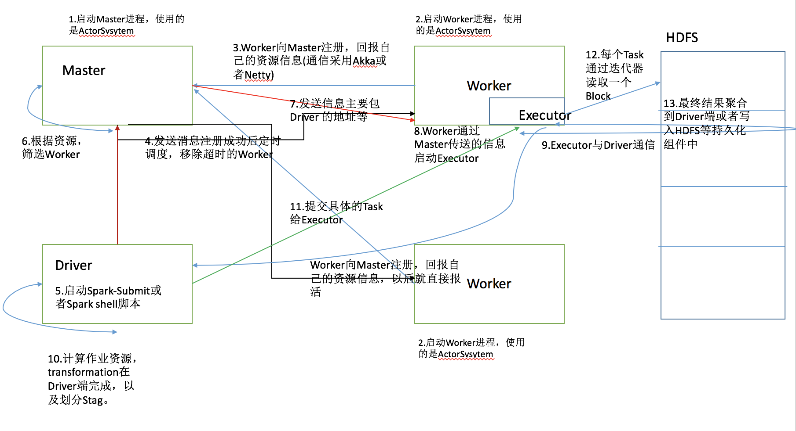

# Spark(基于1.3.1)源码分析
&nbsp;&nbsp;&nbsp;&nbsp;&nbsp;&nbsp;&nbsp;主要针对于Spark源码分析，对于比较重要的方法和代码,有注释,在熟悉Spark源码之前,首先必须了解Akka的通信,

如果不了解的可以看一下我的Demo,点击这里[SPRC](https://github.com/oeljeklaus-you/SPRC) ,这里主要进行的源码分析是:Spark集群启动的脚本、Spark作业

提交的脚本、Spark作业提交中SparkContext、Spark中SparkContext、Executor进程启动的流程和结合简单的WordCount程序对于RDD执行流程进行剖析以及进行Stage

划分分析和Task提交，最后也含有Spark2.0的新特性。
## 启动的脚本
在分析源代码以前,需要首先了解Spark启动脚本做了什么?如果了解这部分流程,这里直接跳过，需要详细了解的可以点击这里查看:
[Spark启动脚本详解](https://github.com/oeljeklaus-you/SparkCore/blob/master/md/Spark启动脚本详解.md)
## Spark执行流程

执行流程描述:

1.通过Shell脚本启动Master，Master类继承Actor类，通过ActorySystem创建并启动。

2.通过Shell脚本启动Worker，Worker类继承Actor类，通过ActorySystem创建并启动。

3.Worker通过Akka或者Netty发送消息向Master注册并汇报自己的资源信息(内存以及CPU核数等)，以后就是定时汇报，保持心跳。

4.Master接受消息后保存(源码中通过持久化引擎持久化)并发送消息表示Worker注册成功，并且定时调度，移除超时的Worker。

5.通过Spark-Submit提交作业或者通过Spark Shell脚本连接集群，都会启动一个Spark进程Driver。

6.Master拿到作业后根据资源筛选Worker并与Worker通信，发送信息，主要包含Driver的地址等。

7.Worker进行收到消息后，启动Executor，Executor与Driver通信。

8.Driver端计算作业资源，transformation在Driver 端完成，划分各个Stage后提交Task给Executor。

9.Exectuor针对于每一个Task读取HDFS文件，然后计算结果，最后将计算的最终结果聚合到Driver端或者写入到持久化组件中。

## SparkContext内部执行流程
[SparkContext流程](https://github.com/oeljeklaus-you/SparkCore/blob/master/md/SparkContext流程.md)
这里涉及SparkEnv的创建,DriverActor、ClientActor、TaskScheduler和DAGScheduler的创建以及资源分配算法。

## Executor启动流程
对于Executor启动流程不熟悉的,可以查看[Executor启动流程](https://github.com/oeljeklaus-you/SparkCore/blob/master/md/Executor启动流程.md)
主要涉及Executor进程如何启动、Executor内部方法
## 结合WordCount的Stage划分
[结合WordCount的Stage划分](https://github.com/oeljeklaus-you/SparkCore/blob/master/md/结合WordCount的Stage划分.md)
涉及RDD知识讲解,Stage划分算法,Stage提交算法,RDD依赖关系。
## 任务提交流程
[任务提交流程](https://github.com/oeljeklaus-you/SparkCore/blob/master/md/任务提交流程.md)
涉及任务如何提交、提交之后Executor如何执行?
