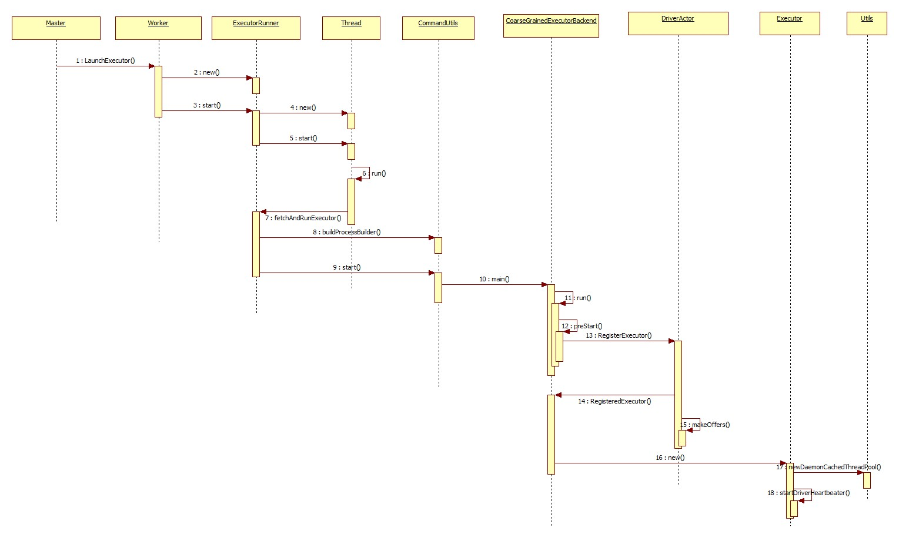
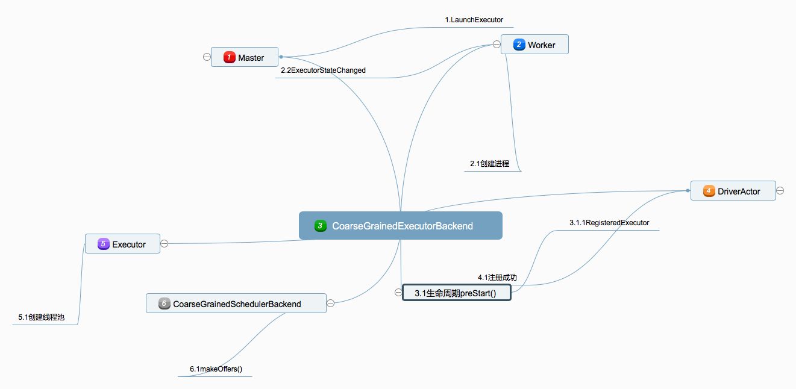

# Executor启动流程

在上面SparkContext进行资源调度后,只有主要的流程是Master和筛选出来的Worker进行通信,然后在Worker中启动Executor进程。

## Executor启动流程流程图

## 源码分析
### Executor进程的启动
这里我们需要追踪的方法是Master类中的schedule()方法内部的607行,这个方法的主要作用是向Worker发送消息,然后启动Executor进程。
<pre><code>
def launchExecutor(worker: WorkerInfo, exec: ExecutorDesc) {
    logInfo("Launching executor " + exec.fullId + " on worker " + worker.id)
    //TODO 记录该Worker使用的资源
    worker.addExecutor(exec)
    //TODO Master发送消息给Worker，把参数通过case class传递给Worker，让他启动Executor，
    worker.actor ! LaunchExecutor(masterUrl,
      exec.application.id, exec.id, exec.application.desc, exec.cores, exec.memory)
    //TODO Master向ClientActor发送消息，告诉它Executor已经启动了
    exec.application.driver ! ExecutorAdded(
      exec.id, worker.id, worker.hostPort, exec.cores, exec.memory)
  }
</code></pre>
以上代码的所做的工作是记录和Master通信的Worker使用的资源,并且发送消息给Worker,最后Master向ClientActor发送的消息,告知Executor已经启动了。

接着,我们将会看Worker的LaunchExecutor样例类模式匹配，这个方法的作用是**启动Executor进程,代码大约在Worker的335行**。
<pre><code>
 //TODO Master发送给Worker的消息，让Worker启动Executor，LaunchExecutor是一个CaseClass里面封装了要启动的Executor启动的信息
    case LaunchExecutor(masterUrl, appId, execId, appDesc, cores_, memory_) =>
      //TODO 判断master是否是活着的Master
      if (masterUrl != activeMasterUrl) {
        logWarning("Invalid Master (" + masterUrl + ") attempted to launch executor.")
      } else {
        try {
          logInfo("Asked to launch executor %s/%d for %s".format(appId, execId, appDesc.name))

          // Create the executor's working directory
          val executorDir = new File(workDir, appId + "/" + execId)
          if (!executorDir.mkdirs()) {
            throw new IOException("Failed to create directory " + executorDir)
          }

          // Create local dirs for the executor. These are passed to the executor via the
          // SPARK_LOCAL_DIRS environment variable, and deleted by the Worker when the
          // application finishes.
          //TODO 为Executor创建目录
          val appLocalDirs = appDirectories.get(appId).getOrElse {
            Utils.getOrCreateLocalRootDirs(conf).map { dir =>
              Utils.createDirectory(dir).getAbsolutePath()
            }.toSeq
          }
          appDirectories(appId) = appLocalDirs
          //TODO 创建一个ExecutorRunner对象，里面包含应用的描述信息等通过这个对象启动Executor
          val manager = new ExecutorRunner(
            appId,//TODO ApplicationID
            execId,//TODO ExecutorID
            appDesc.copy(command = Worker.maybeUpdateSSLSettings(appDesc.command, conf)),//TODO 里面含有Driver的URL
            cores_,//TODO 所用核数
            memory_,//TODO 所用内存
            self,
            workerId,
            host,//TODO Worker Host
            webUi.boundPort,
            publicAddress,
            sparkHome,
            executorDir,
            akkaUrl,//TODO Worker的url
            conf,
            appLocalDirs, ExecutorState.LOADING)
          //TODO 将ExecutorID->Executor放入到HashMap中
          executors(appId + "/" + execId) = manager
          //TODO 调用ExecutorRunner的start()方法来启动Executor子进程
          manager.start()
          coresUsed += cores_
          memoryUsed += memory_
          //TODO 给Master发送消息表示Executor的状态已经改变
          master ! ExecutorStateChanged(appId, execId, manager.state, None, None)
        } catch {
          case e: Exception => {
            logError(s"Failed to launch executor $appId/$execId for ${appDesc.name}.", e)
            if (executors.contains(appId + "/" + execId)) {
              executors(appId + "/" + execId).kill()
              executors -= appId + "/" + execId
            }
            master ! ExecutorStateChanged(appId, execId, ExecutorState.FAILED,
              Some(e.toString), None)
          }
        }
      }v
</code></pre>
在这个模式匹配中,主要的做的是为Executor创建目录,创建一个ExecutorRunner对象，里面包含应用的描述信息等通过这个对象启动Executor,

然后使用脚本命令启动CoarseGrainedExecutorBackend。这里我们将会查看这个CoarseGrainedExecutorBackend类的源码。

下面是CoarseGrainedExecutorBackend的main()方法.
<pre><code>
 //TODO 启动Executor子进程的入口
  def main(args: Array[String]) {
    var driverUrl: String = null
    var executorId: String = null
    var hostname: String = null
    var cores: Int = 0
    var appId: String = null
    var workerUrl: Option[String] = None
    val userClassPath = new mutable.ListBuffer[URL]()

    var argv = args.toList
    while (!argv.isEmpty) {
      argv match {
        case ("--driver-url") :: value :: tail =>
          driverUrl = value
          argv = tail
        case ("--executor-id") :: value :: tail =>
          executorId = value
          argv = tail
        case ("--hostname") :: value :: tail =>
          hostname = value
          argv = tail
        case ("--cores") :: value :: tail =>
          cores = value.toInt
          argv = tail
        case ("--app-id") :: value :: tail =>
          appId = value
          argv = tail
        case ("--worker-url") :: value :: tail =>
          // Worker url is used in spark standalone mode to enforce fate-sharing with worker
          workerUrl = Some(value)
          argv = tail
        case ("--user-class-path") :: value :: tail =>
          userClassPath += new URL(value)
          argv = tail
        case Nil =>
        case tail =>
          System.err.println(s"Unrecognized options: ${tail.mkString(" ")}")
          printUsageAndExit()
      }
    }

    if (driverUrl == null || executorId == null || hostname == null || cores <= 0 ||
      appId == null) {
      printUsageAndExit()
    }

    //TODO 获取必要的参数后，进程启动
    run(driverUrl, executorId, hostname, cores, appId, workerUrl, userClassPath)
  }
</code></pre>
main()方法是启动Executor子进程的入口,然后调用run()方法，这里我们将会追踪这个方法:
<pre><code>
 //TODO CoarseGrainedExecutorBackend真正进行通信的Actor
      env.actorSystem.actorOf(
        Props(classOf[CoarseGrainedExecutorBackend],
          driverUrl, executorId, sparkHostPort, cores, userClassPath, env),
        name = "Executor")
      workerUrl.foreach { url =>
        env.actorSystem.actorOf(Props(classOf[WorkerWatcher], url), name = "WorkerWatcher")
      }
</code></pre>
### CoarseGrainedExecutorBackend的生命周期方法
调用CoarseGrainedExecutorBackend的生命周期方法,在preStart()方法主要代码如下:
<pre><code>
//TODO 生命周期方法，首先和Driver建立连接
  override def preStart() {
    logInfo("Connecting to driver: " + driverUrl)
    driver = context.actorSelection(driverUrl)
    //TODO Executor向Driver发送消息,注册Executor
    driver ! RegisterExecutor(executorId, hostPort, cores, extractLogUrls)
    context.system.eventStream.subscribe(self, classOf[RemotingLifecycleEvent])
  }
</code></pre>
这个方法主要是**和Driver进行通信，向Driver发送信息,注册Executor**我们这里需要看的是DriverActor的代码
<pre><code>
 //TODO Executor向DriverActor发送的消息
      case RegisterExecutor(executorId, hostPort, cores, logUrls) =>
        Utils.checkHostPort(hostPort, "Host port expected " + hostPort)
        if (executorDataMap.contains(executorId)) {
          //TODO DriverActor向Executor发送消息，告诉Executor注册失败
          sender ! RegisterExecutorFailed("Duplicate executor ID: " + executorId)
        } else {
          logInfo("Registered executor: " + sender + " with ID " + executorId)
          //TODO DriverActor向Executor发送消息，告诉Executor注册成功
          sender ! RegisteredExecutor

          addressToExecutorId(sender.path.address) = executorId
          totalCoreCount.addAndGet(cores)
          totalRegisteredExecutors.addAndGet(1)
          val (host, _) = Utils.parseHostPort(hostPort)
          val data = new ExecutorData(sender, sender.path.address, host, cores, cores, logUrls)
          // This must be synchronized because variables mutated
          // in this block are read when requesting executors
          CoarseGrainedSchedulerBackend.this.synchronized {
            executorDataMap.put(executorId, data)
            if (numPendingExecutors > 0) {
              numPendingExecutors -= 1
              logDebug(s"Decremented number of pending executors ($numPendingExecutors left)")
            }
          }
          listenerBus.post(
            SparkListenerExecutorAdded(System.currentTimeMillis(), executorId, data))
          //TODO 查看是否有任务需要提交(DriverActor->Executor)
          makeOffers()
        }
</code></pre>
这里进行一个判断后，向Executor发送注册成功后,然后调用makeOffers()查看是否有任务需要提交。这里我们首先看DriverActor向Executor
向Executor发送消息,表示注册成功，然后再次查看makeOffers()方法。
针对于RegisteredExecutor的,代码如下:
<pre><code>
 //TODO Driver发送给Executor的消息告诉已经注册成功
    case RegisteredExecutor =>
      logInfo("Successfully registered with driver")
      //TODO 这里的hostname主要是DriverActor
      val (hostname, _) = Utils.parseHostPort(hostPort)
      //TODO 创建Executor对象用来执行业务逻辑
      executor = new Executor(executorId, hostname, env, userClassPath, isLocal = false)
</code></pre> 
这里主要是**创建Executor对象用来执行业务逻辑**,接下来我们看一下Executor的构造函数内部做了什么?
<pre><code>
 //TODO 创建线程池
  val threadPool = Utils.newDaemonCachedThreadPool("Executor task launch worker")
  //TODO 和Dirver进行通信，发送心跳信息，这是一个报活的操作
  startDriverHeartbeater()
</code></pre> 
在Executor构造函数中,主要的工作是**创建一个可变的线程池(实现是Java的Executors创建),然后调用startDriverHeartbeater()和Dirver进行通信，发送心跳信息，这是一个报活的操作**。
接下来是makeOffers()方法,主要运行CoarseGrainedSchedulerBackend的launchTasks()方法。
<pre><code>
 //TODO 调用launchTasks向Executor提交Task
    def makeOffers() {
      launchTasks(scheduler.resourceOffers(executorDataMap.map { case (id, executorData) =>
        new WorkerOffer(id, executorData.executorHost, executorData.freeCores)
      }.toSeq))
    }
</code></pre> 
这个方法主要是查看是否有任务需要提交(DriverActor->Executor)

## 百度脑图关于Executor启动

## 总结
创建Executor进程的总结:

1.Worker创建Executor进程,该进程的实现类其实是CoarseGrainedExecutorBackend

2.CoarseGrainedExecutorBackend向DriverActor注册成功后创建Executor对象,内部有一个可变的线程池

3.执行makeOffers()方法，查看是否有任务需要提交
