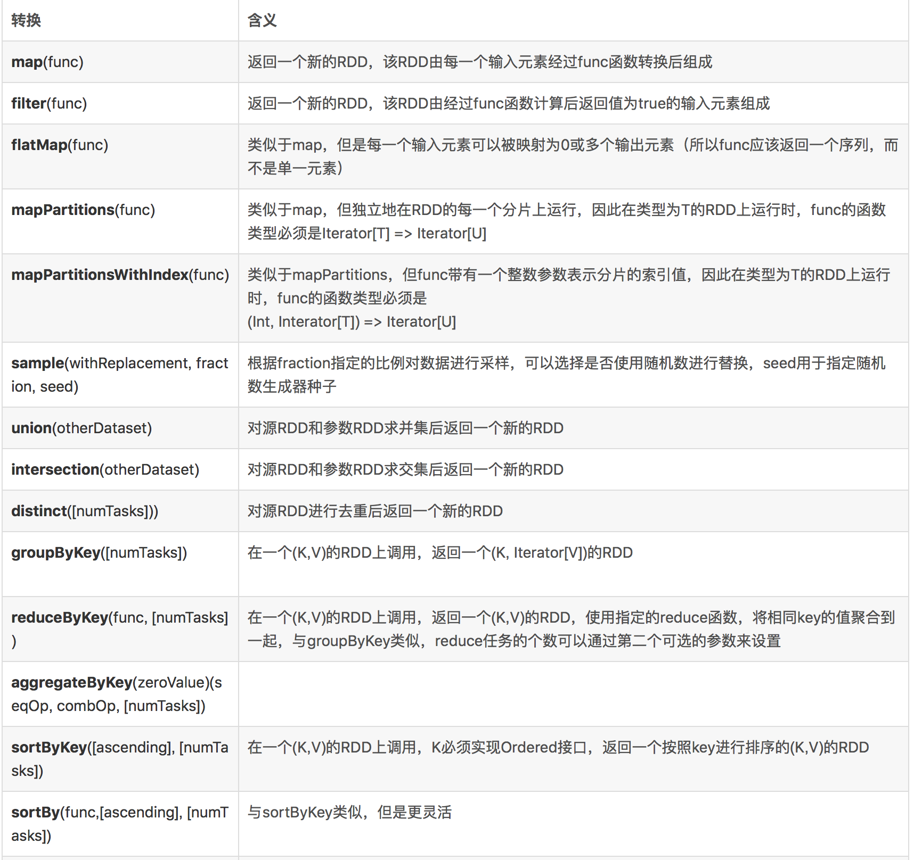
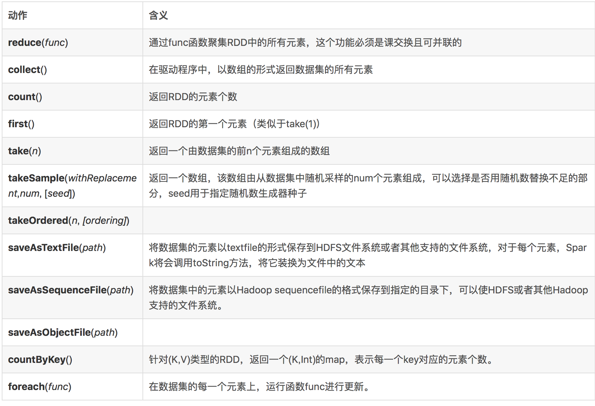

# 弹性分布式数据集RDD

## RDD概述

### 什么是RDD

   RDD（Resilient Distributed Dataset）叫做分布式数据集，是Spark中最基本的数据抽象，它代表一个不可变、可分区、里面的元素可并行计算的集合。RDD具有数据流模型的特点：自动容错、位置感知性调度和可伸缩性。RDD允许用户在执行多个查询时显式地将工作集缓存在内存中，后续的查询能够重用工作集，这极大地提升了查询速度。

### RDD的属性
1）一组分片（Partition），即数据集的基本组成单位。对于RDD来说，每个分片都会被一个计算任务处理，并决定并行计算的粒度。用户可以在创建RDD时指定RDD的分片个数，如果没有指定，那么就会采用默认值。默认值就是程序所分配到的CPU Core的数目。

2）一个计算每个分区的函数。Spark中RDD的计算是以分片为单位的，每个RDD都会实现compute函数以达到这个目的。compute函数会对迭代器进行复合，不需要保存每次计算的结果。

3）RDD之间的依赖关系。RDD的每次转换都会生成一个新的RDD，所以RDD之间就会形成类似于流水线一样的前后依赖关系。在部分分区数据丢失时，Spark可以通过这个依赖关系重新计算丢失的分区数据，而不是对RDD的所有分区进行重新计算。

4）一个Partitioner，即RDD的分片函数。当前Spark中实现了两种类型的分片函数，一个是基于哈希的HashPartitioner，另外一个是基于范围的RangePartitioner。只有对于于key-value的RDD，才会有Partitioner，非key-value的RDD的Parititioner的值是None。Partitioner函数不但决定了RDD本身的分片数量，也决定了parent RDD Shuffle输出时的分片数量。

一个列表，存储存取每个Partition的优先位置（preferred location）。对于一个HDFS文件来说，这个列表保存的就是每个Partition所在的块的位置。按照“移动数据不如移动计算”的理念，Spark在进行任务调度的时候，会尽可能地将计算任务分配到其所要处理数据块的存储位置。

## 创建RDD

1）由一个已经存在的Scala集合创建。

val rdd1 = sc.parallelize(Array(1,2,3,4,5,6,7,8))

2）由外部存储系统的数据集创建，包括本地的文件系统，还有所有Hadoop支持的数据集，比如HDFS、Cassandra、HBase等

val rdd2 = sc.textFile("hdfs://node1:9000/words.txt")

## RDD编程API

### Transformation

   RDD中的所有转换都是延迟加载的，也就是说，它们并不会直接计算结果。相反的，它们只是记住这些应用到基础数据集（例如一个文件）上的转换动作。只有当发生一个要求返回结果给Driver的动作时，这些转换才会真正运行。这种设计让Spark更加有效率地运行。

### Action

